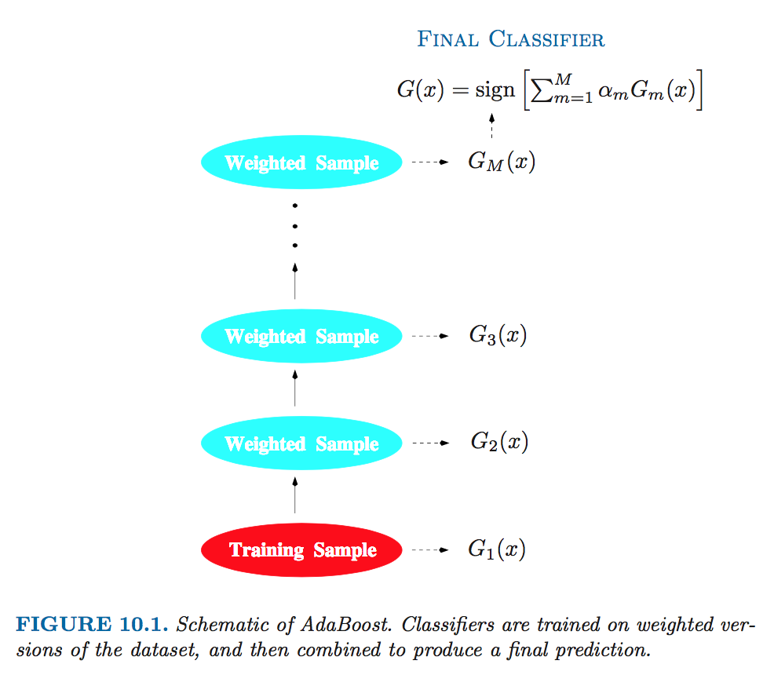
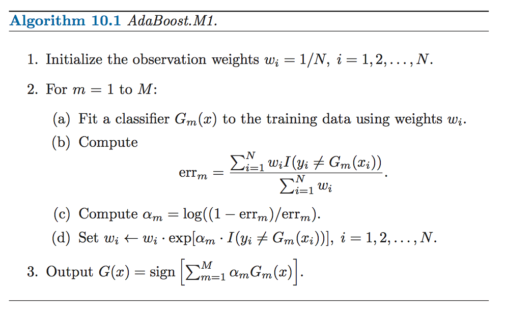
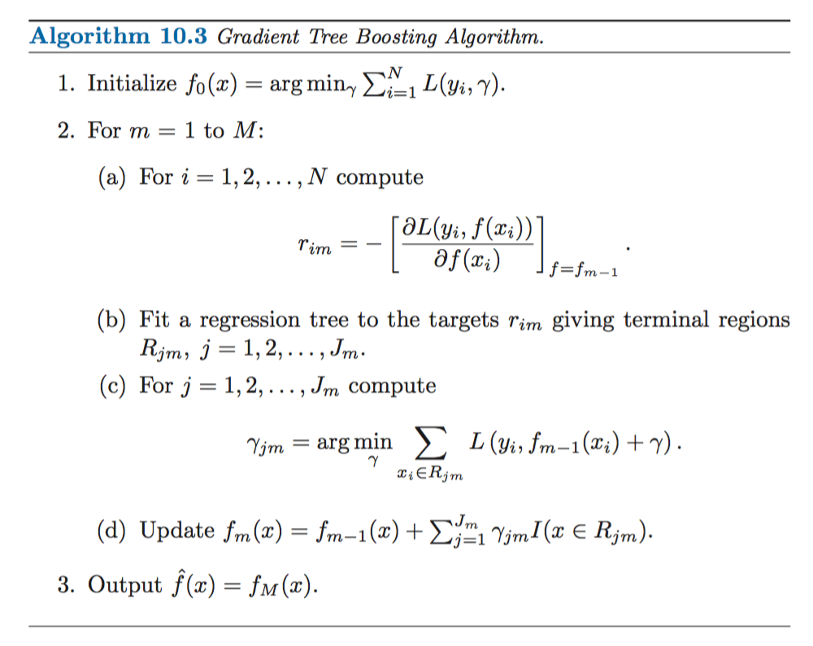
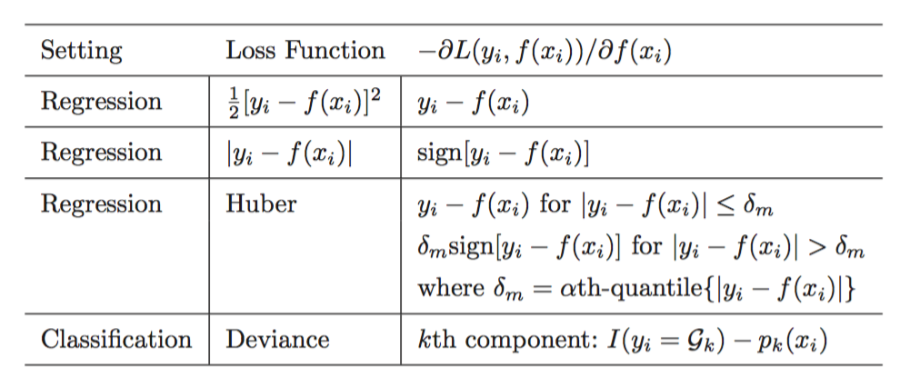

# Gradient Boosting Machines (GBM) {#gradient-boosting-machines}


* * *


* * *
Image Source: brucecompany.com

## Introduction

[Gradient boosting](https://en.wikipedia.org/wiki/Gradient_boosting) is a
machine learning technique for regression and classification problems, which
produces a prediction model in the form of an ensemble of weak prediction
models, typically decision trees. It builds the model in an iterative fashion
like other boosting methods do, and it generalizes them by allowing optimization
of an arbitrary differentiable loss function.

It is recommended that you read through the accompanying [Classification and
Regression Trees Tutorial](decision-trees.ipynb) for an overview of decision
trees.

## History

Boosting is one of the most powerful learning ideas introduced in the last
twenty years. It was originally designed for classification problems, but it can
be extended to regression as well. The motivation for boosting was a procedure
that combines the outputs of many "weak" classifiers to produce a powerful
"committee."  A weak classifier (e.g. decision tree) is one whose error rate is
only slightly better than random guessing.

[AdaBoost](https://en.wikipedia.org/wiki/AdaBoost) short for "Adaptive
Boosting", is a machine learning meta-algorithm formulated by [Yoav
Freund](https://en.wikipedia.org/wiki/Yoav_Freund) and [Robert
Schapire](https://en.wikipedia.org/wiki/Robert_Schapire) in 1996, which is now
considered to be a special case of Gradient Boosting.  There are [some
differences](http://stats.stackexchange.com/questions/164233/intuitive-
explanations-of-differences-between-gradient-boosting-trees-gbm-ad) between the
AdaBoost algorithm and modern Gradient Boosting.  In the AdaBoost algorithm, the
"shortcomings" of existing weak learners are identified by high-weight data
points, however in Gradient Boosting, the shortcomings are identified by
gradients.

The idea of gradient boosting originated in the observation by Leo Breiman that
boosting can be interpreted as an optimization algorithm on a suitable cost
function. Explicit regression gradient boosting algorithms were subsequently
developed by Jerome H. Friedman, simultaneously with the more general functional
gradient boosting perspective of Llew Mason, Jonathan Baxter, Peter Bartlett and
Marcus Frean. The latter two papers introduced the abstract view of boosting
algorithms as iterative functional gradient descent algorithms. That is,
algorithms that optimize a cost function over function space by iteratively
choosing a function (weak hypothesis) that points in the negative gradient
direction. This functional gradient view of boosting has led to the development
of boosting algorithms in many areas of machine learning and statistics beyond
regression and classification.

In general, in terms of model performance, we have the following heirarchy:

$$Boosting > Random \: Forest > Bagging > Single \: Tree$$

## Gradient Boosting

[Gradient boosting](https://en.wikipedia.org/wiki/Gradient_boosting) is a
machine learning technique for regression and classification problems, which
produces a prediction model in the form of an ensemble of weak prediction
models, typically decision trees. It builds the model in a stage-wise fashion
like other boosting methods do, and it generalizes them by allowing optimization
of an arbitrary differentiable loss function.

The purpose of boosting is to sequentially apply the weak classification
algorithm to repeatedly modified versions of the data, thereby producing a
sequence of weak classifiers $G_m(x)$, $m = 1, 2, ... , M$.

## Stagewise Additive Modeling

Boosting builds an additive model:

$$F(x) = \sum_{m=1}^M \beta_m b(x; \gamma_m)$$

where $b(x; \gamma_m)$ is a tree and $\gamma_m$ parameterizes the splits.  With
boosting, the parameters, $(\beta_m, \gamma_m)$ are fit in a *stagewise*
fashion.  This slows the process down, and overfits less quickly.

## AdaBoost

- AdaBoost builds an additive logistic regression model by stagewise fitting.
- AdaBoost uses an exponential loss function of the form, $L(y, F(x)) =
exp(-yF(x))$, similar to the negative binomial log-likelihood loss.
- The principal attraction of the exponential loss in the context of additive
modeling is computational; it leads to the simple modular reweighting
- Instead of fitting trees to residuals, the special form of the exponential
loss function in AdaBoost leads to fitting trees to weighted versions of the
original data.


Source: Elements of Statistical Learning


Source: Elements of Statistical Learning

## Gradient Boosting Algorithm

- The idea of gradient boosting originated in the observation by Leo Breiman that boosting can be interpreted as an optimization algorithm on a suitable cost function.
- Explicit regression gradient boosting algorithms were subsequently developed by Jerome H. Friedman simultaneously with the more general functional gradient boosting perspective of Llew Mason, Jonathan Baxter, Peter Bartlett and Marcus Frean.
- The latter two papers introduced the abstract view of boosting algorithms as iterative functional gradient descent algorithms. That is, algorithms that optimize a cost function over function space by iteratively choosing a function (weak hypothesis) that points in the negative gradient direction.
- This functional gradient view of boosting has led to the development of boosting algorithms in many areas of machine learning and statistics beyond regression and classification.

Friedman's Gradient Boosting Algorithm for a generic loss function, $L(y_i,
\gamma)$:


Source: Elements of Statistical Learning


### Loss Functions and Gradients


Source: Elements of Statistical Learning


The optimal number of iterations, T, and the learning rate, λ, depend on each
other.


## Stochastic GBM

[Stochastic Gradient Boosting](https://statweb.stanford.edu/~jhf/ftp/stobst.pdf)
(Friedman, 2002) proposed the stochastic gradient boosting algorithm that simply
samples uniformly without replacement from the dataset before estimating the
next gradient step. He found that this additional step greatly improved
performance.

## Practical Tips

- It's more common to grow shorter trees ("shrubs" or "stumps") in GBM than you
do in Random Forest.
- It's useful to try a variety of column sample (and column sample per tree)
rates.
- Don't assume that the set of optimal tuning parameters for one implementation
of GBM will carry over and also be optimal in a different GBM implementation.

## Resources

 - [Trevor Hastie - Gradient Boosting & Random Forests at H2O World 2014](https:
//www.youtube.com/watch?v=wPqtzj5VZus&index=16&list=PLNtMya54qvOFQhSZ4IKKXRbMkyL
Mn0caa) (YouTube)
 - [Trevor Hastie - Data Science of GBM
(2013)](http://www.slideshare.net/0xdata/gbm-27891077) (slides)
 - [Mark Landry - Gradient Boosting Method and Random Forest at H2O World
2015](https://www.youtube.com/watch?v=9wn1f-30_ZY) (YouTube)
 - [Peter Prettenhofer - Gradient Boosted Regression Trees in scikit-learn at
PyData London 2014](https://www.youtube.com/watch?v=IXZKgIsZRm0) (YouTube)
 - [Alexey Natekin1 and Alois Knoll - Gradient boosting machines, a
tutorial](http://journal.frontiersin.org/article/10.3389/fnbot.2013.00021/full)
(blog post)

***

## GBM Software in R

This is not a comprehensive list of GBM software in R, however, we detail a few
of the most popular implementations below:
[gbm](https://cran.r-project.org/web/packages/gbm/index.html),
[xgboost](https://cran.r-project.org/web/packages/xgboost/index.html) and
[h2o](https://cran.r-project.org/web/packages/gamboostLSS/index.html).

The [CRAN Machine Learning Task
View](https://cran.r-project.org/web/views/MachineLearning.html) lists the
following projects as well.  The Hinge-loss is optimized by the boosting
implementation in package
[bst](https://cran.r-project.org/web/packages/bst/index.html). Package
[GAMBoost](https://cran.r-project.org/web/packages/GAMBoost/index.html) can be
used to fit generalized additive models by a boosting algorithm. An extensible
boosting framework for generalized linear, additive and nonparametric models is
available in package
[mboost](https://cran.r-project.org/web/packages/mboost/index.html). Likelihood-
based boosting for Cox models is implemented in
[CoxBoost](https://cran.r-project.org/web/packages/CoxBoost/index.html) and for
mixed models in
[GMMBoost](https://cran.r-project.org/web/packages/GMMBoost/index.html). GAMLSS
models can be fitted using boosting by
[gamboostLSS](https://cran.r-project.org/web/packages/gamboostLSS/index.html).

### gbm

Authors: Originally written by Greg Ridgeway, added to by various authors,
currently maintained by Harry Southworth

Backend: C++

The [gbm](https://github.com/gbm-developers/gbm) R package is an implementation
of extensions to Freund and Schapire's AdaBoost algorithm and Friedman's
gradient boosting machine.  This is the original R implementation of GBM. A
presentation is available [here](https://www.slideshare.net/mark_landry/gbm-package-in-r) by Mark Landry.

Features:

- Stochastic GBM.
- Supports up to 1024 factor levels.
- Supports Classification and regression trees.
- Includes regression methods for:
  - least squares
  - absolute loss
  - t-distribution loss
  - quantile regression
  - logistic
  - multinomial logistic
  - Poisson
  - Cox proportional hazards partial likelihood
  - AdaBoost exponential loss
  - Huberized hinge loss
  - Learning to Rank measures ([LambdaMart](https://www.microsoft.com/en-
us/research/wp-content/uploads/2016/02/tr-2008-109.pdf))
- Out-of-bag estimator for the optimal number of iterations is provided.
- Easy to overfit since early stopping functionality is not automated in this
package.
- If internal cross-validation is used, this can be parallelized to all cores on
the machine.
- Currently undergoing a major refactoring & rewrite (and has been for some
time).
- GPL-2/3 License.


```r
#install.packages("gbm")
#install.packages("cvAUC")
library(gbm)
library(cvAUC)
```


```r
# Load 2-class HIGGS dataset
train <- data.table::fread("https://s3.amazonaws.com/erin-data/higgs/higgs_train_10k.csv")
test <- data.table::fread("https://s3.amazonaws.com/erin-data/higgs/higgs_test_5k.csv")
```


```r
set.seed(1)
model <- gbm(
  formula = response ~ .,
  distribution = "bernoulli",
  data = train,
  n.trees = 70,
  interaction.depth = 5,
  shrinkage = 0.3,
  bag.fraction = 0.5,
  train.fraction = 1.0,
  n.cores = NULL # will use all cores by default
  )  
```


```r
print(model)
## gbm(formula = response ~ ., distribution = "bernoulli", data = train, 
##     n.trees = 70, interaction.depth = 5, shrinkage = 0.3, bag.fraction = 0.5, 
##     train.fraction = 1, n.cores = NULL)
## A gradient boosted model with bernoulli loss function.
## 70 iterations were performed.
## There were 28 predictors of which 28 had non-zero influence.
```


```r
# Generate predictions on test dataset
preds <- predict(model, newdata = test, n.trees = 70)
labels <- test[,"response"]

# Compute AUC on the test set
cvAUC::AUC(predictions = preds, labels = labels)
## [1] 0.7741609
```


### xgboost

Authors: Tianqi Chen, Tong He, Michael Benesty

Backend: C++

The [xgboost](https://cran.r-project.org/web/packages/xgboost/index.html) R
package provides an R API to "Extreme Gradient Boosting", which is an efficient
implementation of gradient boosting framework. [Parameter tuning
guide](http://www.analyticsvidhya.com/blog/2016/03/complete-guide-parameter-
tuning-xgboost-with-codes-python/) and more resources
[here](https://github.com/dmlc/xgboost/tree/master/demo).  The xgboost package
is quite popular on [Kaggle](http://blog.kaggle.com/tag/xgboost/) for data
mining competitions.

Features:

- Stochastic GBM with  column and row sampling (per split and per tree) for
better generalization.
- Includes efficient linear model solver and tree learning algorithms.
- Parallel computation on a single machine.
- Supports various objective functions, including regression, classification and
ranking.
- The package is made to be extensible, so that users are also allowed to define
their own objectives easily.
- Apache 2.0 License.


```r
#install.packages("xgboost")
#install.packages("cvAUC")
library(xgboost)
library(Matrix)
library(cvAUC)
```


```r
# convert data.table to data frames
train <- as.data.frame(train)
test <- as.data.frame(test)
```


```r
# Set seed because we column-sample
set.seed(1)

y <- "response"
train.mx <- sparse.model.matrix(response ~ ., train)[,-1]
test.mx <- sparse.model.matrix(response ~ ., test)[,-1]
dtrain <- xgb.DMatrix(train.mx, label = train[,y])
dtest <- xgb.DMatrix(test.mx, label = test[,y])

train.gdbt <- xgb.train(
  params = list(
    objective = "binary:logistic",
    #num_class = 2,
    #eval_metric = "mlogloss",
    eta = 0.3,
    max_depth = 5,
    subsample = 1,
    colsample_bytree = 0.5), 
  data = dtrain, 
  nrounds = 70, 
  watchlist = list(train = dtrain, test = dtest),
  verbose = FALSE   # turn on to see modelling progress
  )
```


```r
# Generate predictions on test dataset
preds <- predict(train.gdbt, newdata = dtest)
labels <- test[,y]

# Compute AUC on the test set
cvAUC::AUC(predictions = preds, labels = labels)
## [1] 0.6367853
```


```r
#Advanced functionality of xgboost
#install.packages("Ckmeans.1d.dp")
library(Ckmeans.1d.dp)

# Compute feature importance matrix
names <- dimnames(data.matrix(train[,-1]))[[2]]
importance_matrix <- xgb.importance(names, model = train.gdbt)

# Plot feature importance
xgb.plot.importance(importance_matrix[1:10,])
```


### h2o

Authors: [Arno Candel](https://www.linkedin.com/in/candel), [Cliff
Click](http://www.cliffc.org/blog/), H2O.ai contributors

Backend: Java

[H2O GBM Tuning guide by Arno Candel](https://github.com/h2oai/h2o-3/blob/master
/h2o-docs/src/product/tutorials/gbm/gbmTuning.Rmd) and [H2O GBM
Vignette](http://docs.h2o.ai/h2o/latest-stable/h2o-
docs/booklets/GBMBooklet.pdf).

Features:

- Distributed and parallelized computation on either a single node or a multi-
node cluster.
- Automatic early stopping based on convergence of user-specied metrics to user-
specied relative tolerance.
- Stochastic GBM with column and  row sampling  (per split and per tree) for
better generalization.
- Support  for  exponential  families  (Poisson,  Gamma,  Tweedie)  and  loss
functions in addition to binomial (Bernoulli), Gaussian and multinomial
distributions, such as Quantile regression (including Laplace)ˆ.
- Grid search for hyperparameter optimization and model selection.
- Data-distributed, which means the entire dataset does not need to fit into
memory on a single node, hence scales to any size training set.
- Uses histogram approximations of continuous variables for speedup.
- Uses dynamic binning - bin limits are reset at each tree level based on the
split bins' min and max values discovered during the last pass.
- Uses squared error to determine optimal splits.
- Distributed implementation details outlined in a [blog
post](http://blog.h2o.ai/2013/10/building-distributed-gbm-h2o/) by Cliff Click.
- Unlimited factor levels.
- Multiclass trees (one for each class) built in parallel with each other.
- Apache 2.0 Licensed.
- Model export in plain Java code for deployment in production environments.
- GUI for training & model eval/viz (H2O Flow).


```r
#install.packages("h2o")
library(h2o)
h2o.init(nthreads = -1)  #Start a local H2O cluster using nthreads = num available cores
## 
## H2O is not running yet, starting it now...
## 
## Note:  In case of errors look at the following log files:
##     /var/folders/ws/qs4y2bnx1xs_4y9t0zbdjsvh0000gn/T//RtmpjhXrun/h2o_bradboehmke_started_from_r.out
##     /var/folders/ws/qs4y2bnx1xs_4y9t0zbdjsvh0000gn/T//RtmpjhXrun/h2o_bradboehmke_started_from_r.err
## 
## 
## Starting H2O JVM and connecting: ... Connection successful!
## 
## R is connected to the H2O cluster: 
##     H2O cluster uptime:         3 seconds 235 milliseconds 
##     H2O cluster timezone:       America/New_York 
##     H2O data parsing timezone:  UTC 
##     H2O cluster version:        3.18.0.4 
##     H2O cluster version age:    28 days, 3 hours and 9 minutes  
##     H2O cluster name:           H2O_started_from_R_bradboehmke_ukx197 
##     H2O cluster total nodes:    1 
##     H2O cluster total memory:   1.78 GB 
##     H2O cluster total cores:    4 
##     H2O cluster allowed cores:  4 
##     H2O cluster healthy:        TRUE 
##     H2O Connection ip:          localhost 
##     H2O Connection port:        54321 
##     H2O Connection proxy:       NA 
##     H2O Internal Security:      FALSE 
##     H2O API Extensions:         XGBoost, Algos, AutoML, Core V3, Core V4 
##     R Version:                  R version 3.4.4 (2018-03-15)
```


```r
# Load 10-class MNIST dataset
train <- read.csv("https://s3.amazonaws.com/erin-data/higgs/higgs_train_10k.csv")
test <- read.csv("https://s3.amazonaws.com/erin-data/higgs/higgs_test_5k.csv")
print(dim(train))
## [1] 10000    29
print(dim(test))
## [1] 5000   29
```


```r
# Identity the response column
y <- "response"

# Identify the predictor columns
x <- setdiff(names(train), y)

# Convert response to factor
train[,y] <- as.factor(train[,y])
test[,y] <- as.factor(test[,y])

# convert train and test data frames to h2o objects
train.h2o <- as.h2o(train)
## 
  |                                                                       
  |                                                                 |   0%
  |                                                                       
  |=================================================================| 100%
test.h2o <- as.h2o(test)
## 
  |                                                                       
  |                                                                 |   0%
  |                                                                       
  |=================================================================| 100%
```


```r
# Train an H2O GBM model
model <- h2o.gbm(
  x = x,
  y = y,
  training_frame = train.h2o,
  ntrees = 70,
  learn_rate = 0.3,
  sample_rate = 1.0,
  max_depth = 5,
  col_sample_rate_per_tree = 0.5,
  seed = 1
  )
## 
  |                                                                       
  |                                                                 |   0%
  |                                                                       
  |====                                                             |   6%
  |                                                                       
  |==========                                                       |  16%
  |                                                                       
  |=============                                                    |  20%
  |                                                                       
  |===============                                                  |  23%
  |                                                                       
  |========================================================         |  86%
  |                                                                       
  |=================================================================| 100%
```


```r
# Get model performance on a test set
perf <- h2o.performance(model, test.h2o)
print(perf)
## H2OBinomialMetrics: gbm
## 
## MSE:  0.1938163
## RMSE:  0.4402457
## LogLoss:  0.5701889
## Mean Per-Class Error:  0.3250041
## AUC:  0.7735961
## Gini:  0.5471923
## 
## Confusion Matrix (vertical: actual; across: predicted) for F1-optimal threshold:
##           0    1    Error        Rate
## 0      1112 1203 0.519654  =1203/2315
## 1       350 2335 0.130354   =350/2685
## Totals 1462 3538 0.310600  =1553/5000
## 
## Maximum Metrics: Maximum metrics at their respective thresholds
##                         metric threshold    value idx
## 1                       max f1  0.345501 0.750442 273
## 2                       max f2  0.114664 0.861856 363
## 3                 max f0point5  0.582133 0.733454 171
## 4                 max accuracy  0.429572 0.704600 237
## 5                max precision  0.948823 0.962963  13
## 6                   max recall  0.018449 1.000000 397
## 7              max specificity  0.995085 0.999568   0
## 8             max absolute_mcc  0.582133 0.407274 171
## 9   max min_per_class_accuracy  0.514547 0.702808 200
## 10 max mean_per_class_accuracy  0.514547 0.702987 200
## 
## Gains/Lift Table: Extract with `h2o.gainsLift(<model>, <data>)` or `h2o.gainsLift(<model>, valid=<T/F>, xval=<T/F>)`
```


```r
# To retreive individual metrics
h2o.auc(perf)
## [1] 0.7735961
```


```r
# Print confusion matrix
h2o.confusionMatrix(perf)
## Confusion Matrix (vertical: actual; across: predicted)  for max f1 @ threshold = 0.345501053865514:
##           0    1    Error        Rate
## 0      1112 1203 0.519654  =1203/2315
## 1       350 2335 0.130354   =350/2685
## Totals 1462 3538 0.310600  =1553/5000
```


```r
# Plot scoring history over time
plot(model)
```


```r
# Retreive feature importance
vi <- h2o.varimp(model)
vi[1:10,]
## Variable Importances: 
##    variable relative_importance scaled_importance percentage
## 1       x26          541.335571          1.000000   0.200106
## 2       x28          229.342468          0.423660   0.084777
## 3       x25          202.556091          0.374178   0.074875
## 4        x6          158.774506          0.293301   0.058691
## 5       x23          154.050354          0.284575   0.056945
## 6       x27          150.640320          0.278275   0.055684
## 7        x4          137.782974          0.254524   0.050932
## 8       x10          111.809761          0.206544   0.041331
## 9        x1          105.712791          0.195281   0.039077
## 10      x22           98.462402          0.181888   0.036397
```


```r
# Plot feature importance
barplot(
  vi$scaled_importance,
  names.arg = vi$variable,
  space = 1,
  las = 2,
  main = "Variable Importance: H2O GBM"
  )
```


Note that all models, data and model metrics can be viewed via the [H2O Flow
GUI](http://127.0.0.1:54321/flow/index.html), which should already be running
since you started the H2O cluster with `h2o.init()`.


```r
# Early stopping example
# Keep in mind that when you use early stopping, you should pass a validation set
# Since the validation set is used to detmine the stopping point, a separate test set should be used for model eval

# fit <- h2o.gbm(
#   x = x,
#   y = y,
#   training_frame = train,
#   model_id = "gbm_fit3",
#   validation_frame = valid,  #only used if stopping_rounds > 0
#   ntrees = 500,
#   score_tree_interval = 5,      #used for early stopping
#   stopping_rounds = 3,          #used for early stopping
#   stopping_metric = "misclassification", #used for early stopping
#   stopping_tolerance = 0.0005,  #used for early stopping
#   seed = 1
#   )
```


```r
# GBM hyperparamters
gbm_params <- list(
  learn_rate = seq(0.01, 0.1, 0.01),
  max_depth = seq(2, 10, 1),
  sample_rate = seq(0.5, 1.0, 0.1),
  col_sample_rate = seq(0.1, 1.0, 0.1)
  )

search_criteria <- list(
  strategy = "RandomDiscrete", 
  max_models = 20
  )

# Train and validate a grid of GBMs
gbm_grid <- h2o.grid(
  "gbm", x = x, y = y,
  grid_id = "gbm_grid",
  training_frame = train.h2o,
  validation_frame = test.h2o,  #test frame will only be used to calculate metrics
  ntrees = 70,
  seed = 1,
  hyper_params = gbm_params,
  search_criteria = search_criteria
  )
## 
  |                                                                       
  |                                                                 |   0%
  |                                                                       
  |=                                                                |   1%
  |                                                                       
  |==                                                               |   3%
  |                                                                       
  |===                                                              |   4%
  |                                                                       
  |====                                                             |   6%
  |                                                                       
  |=====                                                            |   8%
  |                                                                       
  |=======                                                          |  10%
  |                                                                       
  |========                                                         |  12%
  |                                                                       
  |=========                                                        |  14%
  |                                                                       
  |==========                                                       |  16%
  |                                                                       
  |=============                                                    |  19%
  |                                                                       
  |==============                                                   |  22%
  |                                                                       
  |===============                                                  |  23%
  |                                                                       
  |=================                                                |  26%
  |                                                                       
  |===================                                              |  29%
  |                                                                       
  |=====================                                            |  33%
  |                                                                       
  |=======================                                          |  36%
  |                                                                       
  |=========================                                        |  38%
  |                                                                       
  |==========================                                       |  40%
  |                                                                       
  |===========================                                      |  42%
  |                                                                       
  |=============================                                    |  44%
  |                                                                       
  |===============================                                  |  47%
  |                                                                       
  |================================                                 |  50%
  |                                                                       
  |===================================                              |  53%
  |                                                                       
  |====================================                             |  56%
  |                                                                       
  |======================================                           |  58%
  |                                                                       
  |========================================                         |  61%
  |                                                                       
  |=========================================                        |  63%
  |                                                                       
  |==========================================                       |  65%
  |                                                                       
  |===========================================                      |  67%
  |                                                                       
  |=============================================                    |  70%
  |                                                                       
  |==============================================                   |  71%
  |                                                                       
  |================================================                 |  73%
  |                                                                       
  |=================================================                |  75%
  |                                                                       
  |==================================================               |  78%
  |                                                                       
  |=====================================================            |  81%
  |                                                                       
  |=======================================================          |  85%
  |                                                                       
  |=========================================================        |  87%
  |                                                                       
  |===========================================================      |  91%
  |                                                                       
  |=============================================================    |  94%
  |                                                                       
  |===============================================================  |  97%
  |                                                                       
  |=================================================================| 100%

gbm_gridperf <- h2o.getGrid(
  grid_id = "gbm_grid", 
  sort_by = "auc", 
  decreasing = TRUE
  )

print(gbm_gridperf)
## H2O Grid Details
## ================
## 
## Grid ID: gbm_grid 
## Used hyper parameters: 
##   -  col_sample_rate 
##   -  learn_rate 
##   -  max_depth 
##   -  sample_rate 
## Number of models: 20 
## Number of failed models: 0 
## 
## Hyper-Parameter Search Summary: ordered by decreasing auc
##    col_sample_rate learn_rate max_depth sample_rate         model_ids
## 1              0.7       0.07         6         0.5  gbm_grid_model_0
## 2              0.5       0.08         9         1.0  gbm_grid_model_4
## 3              0.3       0.07         9         1.0  gbm_grid_model_2
## 4              0.9       0.05         6         0.9 gbm_grid_model_12
## 5              1.0       0.04         8         0.8 gbm_grid_model_14
## 6              0.5       0.05         5         0.8 gbm_grid_model_11
## 7              0.3       0.01         8         1.0  gbm_grid_model_8
## 8              0.6        0.1         3         0.5 gbm_grid_model_16
## 9              0.6       0.04         4         1.0  gbm_grid_model_1
## 10             1.0       0.03         5         1.0  gbm_grid_model_7
## 11             0.3       0.01         6         1.0 gbm_grid_model_13
## 12             0.9       0.03         3         0.6 gbm_grid_model_19
## 13             0.4       0.08         2         0.8  gbm_grid_model_9
## 14             0.6       0.04         2         0.9  gbm_grid_model_6
## 15             0.2       0.06         2         0.6  gbm_grid_model_3
## 16             0.1       0.04         3         0.5 gbm_grid_model_18
## 17             0.1       0.08         2         1.0 gbm_grid_model_15
## 18             0.1       0.03         3         0.9 gbm_grid_model_17
## 19             0.4       0.02         2         0.6  gbm_grid_model_5
## 20             0.3       0.01         2         0.9 gbm_grid_model_10
##                   auc
## 1  0.7839301615647285
## 2  0.7838318632833396
## 3  0.7832302488426625
## 4  0.7830467640801027
## 5  0.7826461704292708
## 6  0.7791593164166978
## 7  0.7779804610044604
## 8  0.7740917262931815
## 9  0.7724465573480378
## 10 0.7719307729124687
## 11  0.766567885742325
## 12 0.7575386013811632
## 13 0.7557383431671836
## 14 0.7433997369595907
## 15 0.7429429958452486
## 16 0.7402734976732588
## 17 0.7367849544103511
## 18 0.7363177560320314
## 19 0.7226789097095696
## 20 0.7201266937751125
```


The grid search helped a lot.  The first model we trained only had a 0.774 test
set AUC, but the top GBM in our grid has a test set AUC of 0.786.  More
information about grid search is available in the [H2O grid search R
tutorial](https://github.com/h2oai/h2o-tutorials/blob/master/h2o-open-
tour-2016/chicago/grid-search-model-selection.R).


```r
# good practice to shut down h2o environment
h2o.shutdown(prompt = FALSE)
## [1] TRUE
```


## References

[1] [Friedman, Jerome H. Greedy function approximation: A gradient boostingmachine. Ann. Statist. 29 (2001), no. 5, 1189--1232. doi:10.1214/aos/1013203451.http://projecteuclid.org/euclid.aos/1013203451.](http://projecteuclid.org/DPubS?verb=Display&version=1.0&service=UI&handle=euclid.aos/1013203451&page=record)
